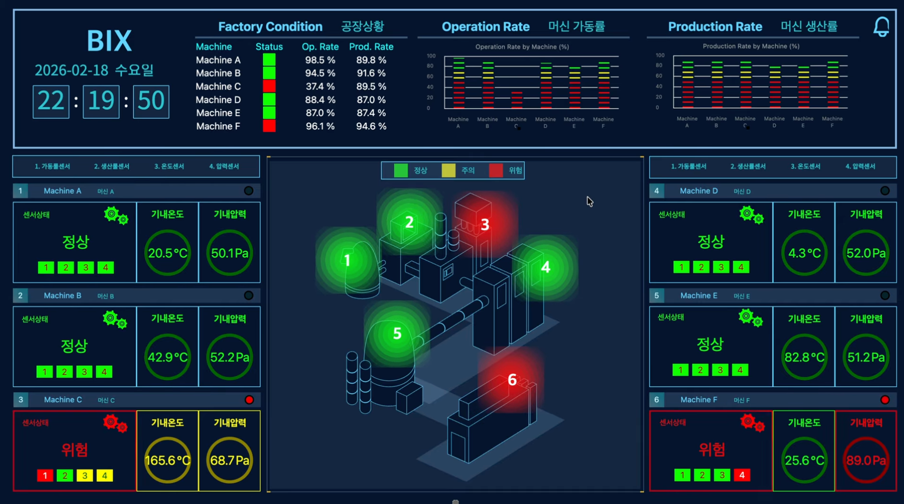

[<- Back to Projects](https://github.com/heesoo-kim97/portfolio-guide/blob/main/README.md)

# Machine Sensor Dashboard

> **Real-Time Manufacturing Monitoring Dashboard | BIX5, JavaScript, HTML, CSS**


---

## Table of Contents

* [Demo](#demo)
* [About This Project](#about-this-project)
* [BIX5 Development -> GitHub Implementation](#BIX5-Development--GitHub-Implementation)
* [Business Case](#business-case)
* [Data & Monitoring Model](#data--monitoring-model)
* [How It Works](#how-it-works)
* [JavaScript & Dashboard Components](#JavaScript--Dashboard-Components)
* [Dashboard Monitoring](#dashboard-monitoring)
* [Operational Applications](#operational-applications)
* [Technologies](#technologies)
* [Repository Structure](#repository-structure)
* [Key Insights](#key-insights)

---

## Demo

The original dashboard is hosted on BIX5, a Korean BI/dashboard visualization platform. This GitHub repository is an English/local implementation that can be run directly through `machine.html`. The demo video shows the locally hosted `machine.html`.


### Video Demo

[](https://youtu.be/FkOtU3PqCDQ)

**▶️ Click the image above to watch the interactive dashboard demo**

The demo showcases the dashboard's real-time machine monitoring capabilities, including dynamic sensor values, circular gauges, machine health classification, and color-coded status alerts.

---

## About This Project

The **Machine Sensor Dashboard** is a manufacturing operations monitoring system originally developed and hosted on **BIX5**.

The dashboard monitors **six machines (A–F)** across four operational metrics:

* Operation Rate
* Production Rate
* Machine Temperature
* Internal Pressure

The original dashboard was built using **BIX5's widget and layout system**. BIX5 also allows JavaScript to be used within individual widgets and layouts, which I used to customize the dashboard's behavior, visual presentation, data handling, condition monitoring, and interactive elements.

For this GitHub repository, I translated the original BIX5 implementation into a standalone **HTML, CSS, and JavaScript** implementation that can be run locally through:

```text
machine.html
```

This repository therefore provides a way to review the underlying implementation outside of the original BIX5 environment.

---

## BIX5 Development → GitHub Implementation

The project consists of two implementations of the same dashboard concept.

```text
                Original BIX5 Dashboard
                         │
             ┌───────────┴───────────┐
             │                       │
       BIX5 Widgets & Layouts   JavaScript
             │                       │
             └───────────┬───────────┘
                         │
                Dashboard System
                         │
                         ↓
              GitHub Translation
                         │
             ┌───────────┴───────────┐
             │                       │
           HTML                    JavaScript
             │                       │
        machine.html          Individual .js files
```

### Original BIX5 Version

The original dashboard was developed and hosted within **BIX5**.

BIX5 provided the underlying dashboard environment, including:

* Widgets
* Layouts
* Dashboard objects
* Visualization containers
* Interface structure

Within those widgets and layouts, **JavaScript was used to customize and develop the dashboard's functionality and visual behavior**.

The demo video in this repository represents this original BIX5 implementation.

### GitHub Version

Because the original implementation was built within the BIX5 environment, the GitHub repository is **not a direct export of the BIX5 project**.

Instead, I translated the dashboard into standalone web code.

The translation involved recreating:

* BIX5 widgets as HTML elements
* BIX5 objects as HTML/JavaScript components
* BIX5 layouts as HTML/CSS structure
* Widget-specific JavaScript functionality as individual `.js` files
* Dashboard behavior and condition logic in standalone JavaScript

The result can be run locally by opening:

```text
machine.html
```
---

## Business Case

Manufacturing operations require continuous visibility into equipment performance and operating conditions.

This dashboard provides a centralized view of machine-level performance by combining multiple operational measurements into a single monitoring interface.

The system is designed to help operations users:

* Monitor machine performance
* Track operation and production KPIs
* Identify abnormal operating conditions
* Prioritize machines requiring attention
* Monitor temperature and pressure conditions
* Quickly distinguish normal, caution, and critical conditions

Rather than requiring users to review each sensor value independently, the dashboard translates sensor measurements into clear visual machine conditions.

---

## Data & Monitoring Model

The dashboard generates simulated sensor values for six machines.

Each machine contains four monitored measurements:

| Metric                  | Purpose                                 | Monitoring Logic                                     |
| ----------------------- | --------------------------------------- | ---------------------------------------------------- |
| **Operation Rate**      | Machine operating performance           | `< 60%` Critical, `60–79.9%` Caution, `≥ 80%` Normal |
| **Production Rate**     | Production performance                  | `< 60%` Critical, `60–79.9%` Caution, `≥ 80%` Normal |
| **Machine Temperature** | Machine-specific temperature monitoring | Thresholds vary by machine                           |
| **Internal Pressure**   | Internal pressure monitoring            | `< 65` Normal, `65–79.9` Caution, `≥ 80` Critical    |

### Machine-Specific Temperature Thresholds

Different machines use different temperature operating ranges.

| Machine |   Caution |  Critical |
| ------- | --------: | --------: |
| A       |  ≥ 25.5°C |  ≥ 41.5°C |
| B       |  ≥ 48.0°C |  ≥ 61.0°C |
| C       | ≥ 165.0°C | ≥ 179.0°C |
| D       |   ≥ 7.4°C |  ≥ 11.1°C |
| E       |  ≥ 85.7°C |  ≥ 89.5°C |
| F       |  ≥ 29.1°C |  ≥ 35.5°C |

---

 ## How It Works

The dashboard follows a continuous data monitoring workflow:

```text
Simulated Sensor Data
        ↓
Centralized Machine Data
        ↓
5-Second Data Refresh
        ↓
Dashboard Update Event
        ↓
Condition Evaluation
        ↓
Machine Status
        ↓
Visual & Audible Alerts
```

### 1. Generate Machine Data

`data.js` generates simulated values for six machines.

Each machine receives:

```text
Operation Rate
Production Rate
Machine Temperature
Internal Pressure
```

The data is organized in the centralized `factoryData` object.

### 2. Refresh Operational Data

Machine data is regenerated every five seconds:

```js
const intervalData = setInterval(setFactoryData, 5000);
```

This creates a continuous monitoring simulation.

### 3. Distribute Updated Data

Once the machine data is generated, the system dispatches the `factoryDataReady` event.

Multiple JavaScript components listen for this event and update their corresponding dashboard elements.

This allows individual dashboard components to respond to the same underlying machine data.

### 4. Evaluate Conditions

`condition.js` evaluates operation rate, production rate, pressure, and machine-specific temperature against predefined thresholds.

Each machine is classified as:

* 🟢 **Normal**
* 🟡 **Caution**
* 🔴 **Critical**

The overall machine condition reflects the most severe condition detected among its monitored measurements.

---

## JavaScript & Dashboard Components

One of the main characteristics of this project is that the dashboard functionality was distributed across individual BIX5 widgets and objects.

When translating the project into standalone web code, these components were represented as separate JavaScript files.

### Core Data & Logic

| File           | Function                                       |
| -------------- | ---------------------------------------------- |
| `data.js`      | Generates and refreshes simulated machine data |
| `condition.js` | Evaluates machine operating conditions         |
| `alarm.js`     | Handles critical-condition audible alerts      |
| `time.js`      | Updates dashboard date and time                |

### Machine Visualization & Interface

| File          | Function                                   |
| ------------- | ------------------------------------------ |
| `temp.js`     | Displays and evaluates machine temperature |
| `pressure.js` | Handles pressure-related visualization     |
| `chart.js`    | Handles dashboard chart visualization      |
| `box.js`      | Dashboard object/interface behavior        |
| `border.js`   | Dashboard border/visual behavior           |
| `pop.js`      | Dashboard popup behavior                   |
| `ripple.js`   | Dashboard visual effect                    |
| `stick.js`    | Dashboard visual component                 |
| `text.js`     | Dashboard text elements                    |

Some of these JavaScript files correspond to **specific widgets or visual objects from the original BIX5 dashboard**. Rather than having one monolithic JavaScript file, the functionality was separated according to the dashboard components they controlled.

---

## Dashboard Monitoring

The dashboard combines multiple interface components to provide machine-level operational visibility.

### Machine Status

Each machine has an overall status indicator based on its monitored operating conditions.

```text
Normal → Caution → Critical
```

### Operation & Production

Operation and production rates are displayed for each machine and evaluated against their corresponding performance thresholds.

### Temperature

Temperature values are displayed individually for each machine.

Because the machines operate at different temperature ranges, the dashboard applies **machine-specific thresholds** when determining temperature conditions.

### Pressure

Internal pressure values are displayed and evaluated using defined caution and critical thresholds.

### Audible Alert

The dashboard includes a global audible alarm that activates when a critical condition is detected.

---

## Operational Applications

The project demonstrates how operational data can be converted into a monitoring interface that supports:

* **KPI monitoring** — operation and production performance
* **Equipment monitoring** — temperature and pressure conditions
* **Condition-based analysis** — threshold-based classification
* **Exception identification** — highlighting caution and critical conditions
* **Automated monitoring** — periodic data refresh
* **Operational visibility** — consolidating multiple measurements into one dashboard
* **Alerting** — visual and audible notification of critical conditions

---

## Technologies


---

## Repository Structure

```text
machine-sensor-dashboard/
│
├── audio/
│   └── dashboard alarm audio
│
├── photo/
│   └── dashboard images
│
├── source/
│   ├── alarm.js
│   ├── border.js
│   ├── box.js
│   ├── chart.js
│   ├── condition.js
│   ├── data.js
│   ├── pop.js
│   ├── pressure.js
│   ├── ripple.js
│   ├── stick.js
│   ├── temp.js
│   ├── text.js
│   └── time.js
│
├── style/
│   └── dashboard styling
│
├── machine.html
└── README.md
```

---

## Key Insights

The dashboard demonstrates how multiple independent sensor readings can be transformed into a single **machine-level health classification**.

Instead of manually reviewing temperature, pressure, production, and operation metrics separately, operators can use the dashboard's visual indicators to quickly identify machines that may require intervention.

Condition-based monitoring can support:

* Faster identification of abnormal equipment conditions
* Proactive maintenance planning
* Improved operational visibility
* Prioritization of equipment requiring intervention
* Reduced risk of unplanned downtime

